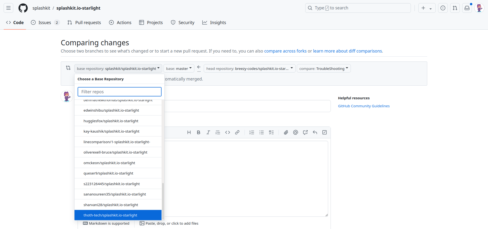
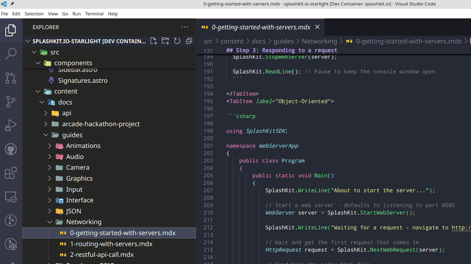

## How to Create a Pull Request

This guide provides a step-by-step process for creating a pull request (PR) in the SplashKit Starlight
repository, PRs are the primary way to contribute changes to the project. By following these steps,
you can submit your own PRs and collaborate with other team members effectively.

### 1. Check for Upstream Branches

Before creating a pull request, it's important to ensure that your local repository is connected to
the correct upstream repository. The upstream repository is the original repository from which your
fork was created. You need this connection to pull in the latest changes from the main project.

To check if upstream branches are already linked to your local repository, run the following command:

```shell
git remote -v
```

This will display a list of remote repositories linked to your local repository. If the `upstream`
branch is not listed, you will need to add it in the next step.

### 2. Add Upstream Branches (if not present)

If the upstream branch is not already added, you can manually add it to your local repository. This
ensures you can fetch and merge changes from the main repository whenever necessary.

To add the upstream branch, run the following command, replacing `<repo-name>` with the actual name
of the repository you're working with (e.g., `splashkit.io-starlight`).

```shell
git remote add upstream https://github.com/thoth-tech/<repo-name>.git
```

#### Example with `splashkit.io-starlight` Repository

For the `splashkit.io-starlight` repository, the command will look like this:

```shell
git remote add upstream https://github.com/thoth-tech/splashkit.io-starlight.git
```

### 3. Verify Upstream Branches

After adding the upstream branch, verify that it has been added correctly by running the following
command again:

```shell
git remote -v
```

You should see something like this:

```shell
origin  https://github.com/YOUR-USERNAME/splashkit.io-starlight.git (fetch)
origin  https://github.com/YOUR-USERNAME/splashkit.io-starlight.git (push)
upstream  https://github.com/thoth-tech/splashkit.io-starlight.git (fetch)
upstream  https://github.com/thoth-tech/splashkit.io-starlight.git (push)
```

If the upstream branch is correctly listed, you are now ready to create your pull request.

## Sync Your Fork (Optional but Recommended)

Before creating a pull request, it's good practice to sync your local fork with the upstream
repository to ensure you're working with the latest version. Run the following commands to fetch
and merge the latest changes from the upstream repository:

```shell
git fetch upstream
git checkout main
git merge upstream/main
```

This ensures that your pull request will not conflict with the latest updates made by others.

## Creating a Pull Request

There are two primary ways to create a pull request: using the GitHub website or the GitHub
Pull Requests extension in VSCode.

### Using the GitHub Website

#### 1. Open GitHub to Review the Pull Request

Head to GitHub and navigate to your forked repository. Once there, click on the **Pull requests**
tab at the top of the page, and then click the **New pull request** button.


#### 2. Select the Correct Repository and Branches

Next, make sure you're comparing the correct branches:

- **Base Repository**: This should be set to `thoth-tech/splashkit.io-starlight` (the original
- repository you're contributing to).
- **Base Branch**: Select `main` as the branch to merge into.

The other dropdown should show your forked repository and the branch you want to merge from.



Ensure these settings are correct to avoid submitting changes to the wrong branch or repository.

#### 3. Review Your Changes

GitHub will display a comparison of the changes between your branch and the `main` branch of the
upstream repository. This is your opportunity to double-check the modifications you're proposing to merge.

Make sure everything looks correct before proceeding.

#### 4. Add Pull Request Details

When you create a pull request, you'll need to provide some additional information using a pull
request template. This helps reviewers understand the context of your changes. Make sure to:

- Provide a clear and descriptive title for your pull request.
- Fill out the required fields in the template, such as the purpose of the changes, testing steps,
  and any additional notes.


Be as detailed as possible. This makes it easier for reviewers to understand your contribution and
provide feedback.

#### 5. Submit the Pull Request

Once you've filled out the template and confirmed your changes, click the **Create pull request**
button. Your pull request will now be submitted and visible to the repository maintainers and
reviewers for feedback.

### Using the GitHub Pull Requests Extension in VSCode

Alternatively, you can use the [GitHub Pull Requests extension](https://marketplace.visualstudio.com/items?itemName=GitHub.vscode-pull-request-github)
for VSCode. This allows you to create pull requests directly from your code editor.

#### 1. Open the Extension

In VSCode, click on the GitHub Pull Requests icon in the sidebar. If you don't see it, you can
install it from the Extensions Marketplace.

#### 2. Create the Pull Request

Click the **Create Pull Request** button, which will give you the option to select the branch
you want to merge from (your working branch) and the branch you want to merge into (usually `main`).

Follow the same steps as on the GitHub website to review your changes, fill out the pull request
template, and submit it.



## Next Steps After Submitting a Pull Request

Once your pull request is submitted, move the associated Planner card to the **First Peer Review**
column in your project management tool, and share both the pull request and the Planner card
with your team or peer reviewers. Follow the information on the[Planner Board Ettiquette](/products/splashkit/splashkit-website/onboarding/07-planner-board)
page to ensure a smooth review process.

Keep an eye out for feedback from the reviewer, and be prepared to make changes if necessary.

### Useful Links

- [Pull Request Template](/products/splashkit/splashkit-website/onboarding/04-pull-request-template):
  The template for creating a pull request for SplashKit team.
- [Peer Review Guide](/products/splashkit/splashkit-website/onboarding/05-peer-review):
  The guide on how to perform a peer review within the SplashKit team.
